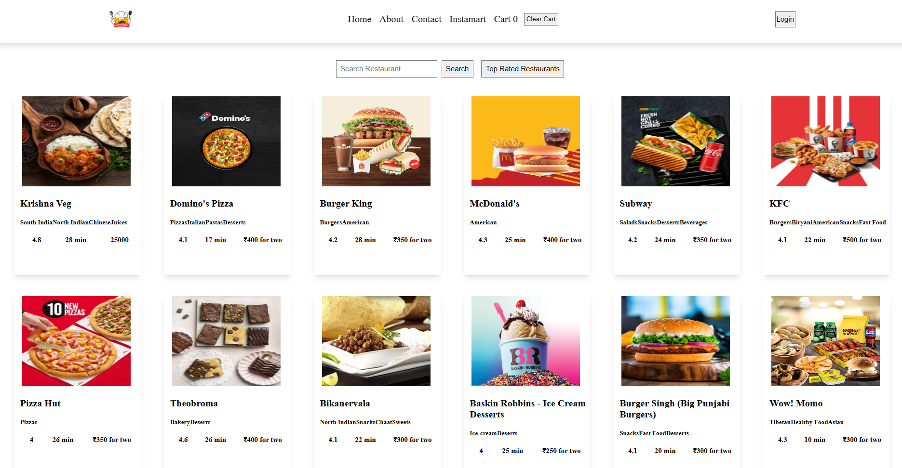

# restaurants-fe

foodSpot is a web application built on the MERN (MongoDB, Express.js, React.js, Node.js) stack.

## Features

- **Restaurant Listings:** Browse through a curated list of restaurants fetched from the server.
- **Search Functionality:** Utilize the search bar and search button to find specific restaurants based on keywords.
- **Top Rated Restaurants:** Quickly access top-rated restaurants with the click of a button.
- **Cart Functionality:** Conveniently manage your orders using the cart functionality integrated into the navigation bar.

## Technologies Used

- **Frontend:** React.js
- **Backend:** Node.js, Express.js
- **Database:** MongoDB
- **API Testing:** Thunder Client
